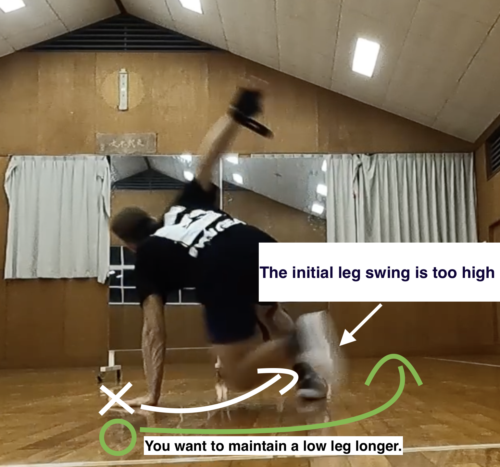
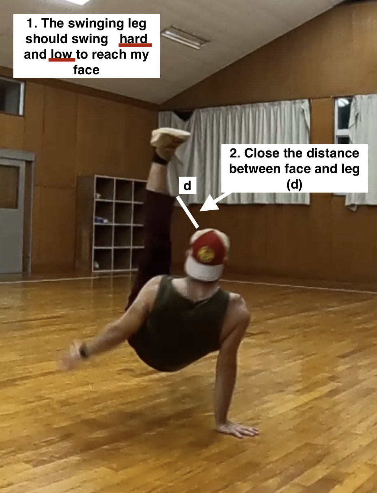

## Heads up

My specialty is breakdance, but feel free to read the parts that are interesting or applicable to you. Breakdance can also be referred to as "bboy".   <a href="#footnotes" class="secondary-a"> 1.</a> 

&nbsp;

## Mindset 

Dancing exposes you to various unusual body positions. Take pride in every move you do. Those parts of your body that are moving in harmony or chaos belong uniquely to you. Own your style and reach new heights of freedom. 

&nbsp;

## General tips

- Pick a theme to focus on during your practice sessions.
- Name your moves and create combos.
- You don't always have to dance on beat. You listen to the beat and choose the timing that's appropriate for you.
- Record yourself dancing and describe what parts you like or want to improve.
- Watch people of all skill levels.
- Dance around an obstacle. Place a water bottle on the ground and try to dance around it without touching it.

&nbsp; 

## Footwork themes

I've based this on footwork, but toprock works too. You can get creative with theme you set yourself.

&nbsp;
### Footwork 
- X-Step variations (e.g., 4-step variations).
- Experiment with different types of footwork. Some people like to do their steps close to each other and others like to go wide. 
- Vary the speeds of your steps.
- Dance around an obstacle. A water bottle is a good one.
- Take space / Restrict space.
- Vary the direction you dance in.
- Restrict certain movements (e.g., no use of knees, spins).
- Practice only one move. 

&nbsp;

One version of a session: 

1. Stretch.
2. Light footwork and toprock warmup.
3. Theme-based drills -  Restricting my left hand.
4. Showcase - Incorporate what I did in 1 minute rounds.
5. Random moves - Have fun dancing.
6. Stretch.

&nbsp;

## Power move: Flare 

 It's one of the power moves I truly find captivating. I still can't do them well, but I'll say my piece on them. It's no surprise that 'powers' require a lot of dedication and patience. It's perfectly fine to erupt in frustration when you swing your legs and fall flat on your behind. I've mentioned above that owning your style is a healthy mindset to have, but this is also true for the way you fail. The way your body struggles with flares, and your approach on how to fix them is unique. Checking YouTube videos, analyzing your videos frame by frame, uploading them online for feedback are all valid methods. I recently discovered there was a subreddit for bboy and users post 'what am I doing wrong?' videos. It takes a lot of courage to actively seek feedback like that.

 &nbsp;

### General tips

- Stretch. I recommend improving your pancake stretch mobility. A flexible body goes a long way. 
- Dips, tuck planches and side planks help too. (Variable)
- Wear shoes you don't mind destroying. 
- Don't wear shorts unless you like scraped knees. I'm cool with that.
- Try to count the number of flares you do per session.  I like to count them dramatically or theatrically. When I complete 10, I mark them in a small notebook. The physical act of writing makes it feel more rewarding than typing it on a notes app.

&nbsp;

### Initial leg swing <a href="#footnotes"> 

The very first movement you should focus on is the initial leg swing. Swinging  your starting leg <u>**hard** </u> and <u>**low**</u> in a </u> <u> **circular**</u> motion will make a huge difference. If you start too high, you're bound to fall. Try to overshoot how low you can go. Then, you focus on getting the swinging leg as close to your face as possible. Finally, you consciously try to pull your other leg in. It's easier if you focus on your hips though.

&nbsp; 

&nbsp;

### Hands and Arms

Keep your hands pushing against the ground at all times. It's easy to forget; I try to place my hand down as I I swing my leg. Furthermore, you always want to use your arms to lean your body in the opposite way of your legs. For example, if your legs are facing the right side, you should lean your body left. The idea comes from <a  class="secondary-a" href="https://www.youtube.com/playlist?list=PLpJRb_Th3m5SK6LaTv4kOTlxPnCX_jojD"> pigmie's flare playlist </a> on Youtube.

 

#####   Hips

When I showed a friend of mine the move, he told me to not hyperfocus on the way I swang my legs, but rather focus more on how I rotate my hips. Initially, I was obsessed with trying to get a decent leg swing, but his advice was golden and it changed the way I saw the move. An outsider point of view does great wonders.

&nbsp;

#####   Keep the flare going

Even if you fail the move, don't stop the movement. Quickly  restart the flare from the position where you landed. 

&nbsp;

###  Don't force it.

Catch your breath and try again when you're in a calmer state.

&nbsp;

## Support

 
### Stretching 

Through b-boying and especially training for flares, I came to truly appreciate stretching as an integral part of my life. Not only does it help you prevent injuries, it makes your moves cleaner. Mobility around the hips is especially important in power moves. I'm pretty tight around the hips, so I like stretches that target them: pigeons, frogs and butterflies. I am one with nature alright. Also, from what I've seen, I try to aim for 3 sets of 30 seconds per stretch. I don't have a specific stretching routine, but I know the ones needed to target the stiffness I have. For hand stretches, I usually compound them with walking.

&nbsp; 

### Walking and Conditioning 

When you’re not dancing, walking and conditioning exercises are great substitutes. I want to feel light when I dance, so I try to make an effort to keep my weight in check. Walking is top-notch because it’s sustainable for life. I sometimes bring a bright yellow resistance band to stretch my fingers, hands and arms. Take care of your gentle hands, you don't realize the strain you're putting on them. If I have a few extra calories to burn, I like to jump rope.  Fun fact, in French, jump rope translates to "corde à danser", which literally means dance rope.

&nbsp;

## Footnotes

1. The  <a class="secondary-a"  href="https://en.wikipedia.org/wiki/Breakdancing"> wikipedia </a> page puts the parentheses after the definition (when performed by men) which made me chuckle the first time I read it. You can also use b-girl (when performed by women).

